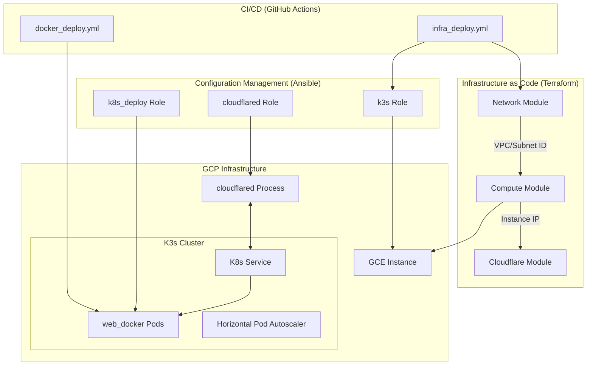

# Project Architecture

This document describes the architectural components and deployment flow of the project.

## System Architecture Diagram

## Component Overview

### 1. CI/CD (GitHub Actions)
- **`infra_deploy.yml`**: Provisions infrastructure using Terraform and configures the environment using Ansible.
- **`docker_deploy.yml`**: Builds and pushes the application Docker image, then updates the Kubernetes deployment.

### 2. Infrastructure as Code (Terraform)
- **Network Module**: Configures the VPC and subnets within Google Cloud Platform (GCP).
- **Compute Module**: Provisions the Google Compute Engine (GCE) instance where the cluster resides.
- **Cloudflare Module**: Manages DNS records and security settings, pointing to the provisioned infrastructure.

### 3. Configuration Management (Ansible)
- **k3s Role**: Installs and configures a lightweight Kubernetes (K3s) distribution.
- **cloudflared Role**: Sets up a Cloudflare Tunnel for secure, ingress-less access to the cluster.
- **k8s_deploy Role**: Deploys Kubernetes manifests including Deployments, Services, and HPAs.

### 4. Application (web_docker)
- A Dockerized web application (Nginx-based) serving `index.html`.
- Managed as a Kubernetes Deployment within the K3s cluster, with automatic scaling via HPA.
