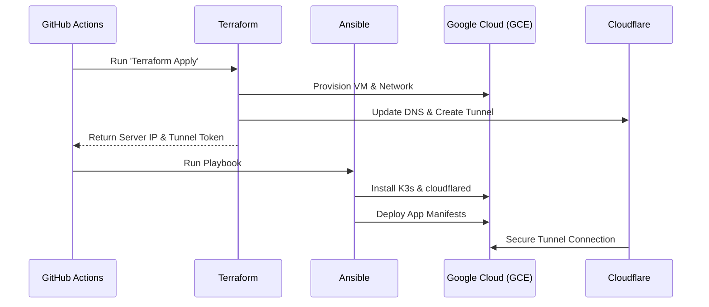

# Bucheong Cat Monitor Project

This project automates the infrastructure provisioning on GCP, DNS configuration via Cloudflare, and application deployment using a lightweight Kubernetes (K3s) cluster. It features a complete CI/CD pipeline, secure access through Cloudflare Tunnels, and automated monitoring.

## 📁 Project Structure

```text
.
├── .github/workflows/          # CI/CD Pipeline definitions
│   ├── infra_deploy.yml        # Provisions infra (TF) and configures OS (Ansible)
│   ├── docker_deploy.yml       # Builds and pushes Docker image to Docker Hub
│   └── infrastructure_destroy.yml # Destroys all provisioned resources
├── ansible/                    # Configuration management (Server & K3s)
│   ├── playbook.yml            # Main playbook for server setup
│   └── roles/                  # Specialized roles for K3s, Cloudflare, etc.
├── terraform/                  # Infrastructure as Code (GCP & Cloudflare)
│   ├── main.tf                 # Module orchestration
│   ├── modules/                # Reusable modules (Network, Compute, Cloudflare)
│   ├── outputs.tf              # IPs and Tunnel tokens
│   └── variables.tf            # Configuration inputs
├── web_docker/                 # Application source code
│   ├── Dockerfile              # Container build instructions
│   └── index.html              # Main web page
└── ARCHITECTURE.md             # Detailed architecture documentation
```

## 🏗️ Core Components & Logic

### 1. Infrastructure (Terraform)
- **GCP Resources**: Provisions a VPC, subnets, and a Google Compute Engine (GCE) instance.
- **Cloudflare**: Manages DNS records and initializes Cloudflare Tunnels for secure ingress without exposing open ports.
- **Backend**: Uses a GCS bucket to store Terraform state securely.

### 2. Configuration (Ansible)
- **k3s**: Installs a lightweight Kubernetes distribution on the Ubuntu server.
- **cloudflared**: Sets up the Cloudflare Tunnel client as a systemd service, bridging external traffic to the K8s services.
- **k8s_deploy**: Deploys the application manifests (Deployment, Service, HPA) into the cluster.

### 3. Application (web_docker)
- A simple Nginx-based web application.
- Scaled automatically within K3s using Horizontal Pod Autoscaler (HPA) based on resource usage.

## 🚀 Deployment Flow



## 🛠️ Setup & Usage

### Required GitHub Secrets
To run the workflows, the following secrets must be configured in your repository:

| Secret Name | Description |
| ----------- | ----------- |
| `GCP_SA_KEY` | GCP Service Account Key (JSON) |
| `GCP_PROJECT_ID` | Your GCP Project ID |
| `CLOUDFLARE_API_TOKEN` | Cloudflare API Token (DNS/Tunnel permissions) |
| `CLOUDFLARE_ZONE_ID` | Cloudflare Zone ID for your domain |
| `CLOUDFLARE_ACCOUNT_ID`| Cloudflare Account ID |
| `SSH_PUB_KEY` | Public SSH key for the GCE instance |
| `SSH_PRIVATE_KEY` | Private SSH key for Ansible/K8s control |
| `DOCKER_USERNAME` | Docker Hub username |
| `DOCKER_PASSWORD` | Docker Hub password/token |
| `ACTION_WEBOOK_URL` | Discord webhook for GitHub Actions status |
| `DISCORD_WEBHOOK_URL`| Discord webhook for server monitoring alerts |

### Triggering Actions
1. **Infrastructure Deployment**: Run the `Infrastructure and Deployment` workflow manually from the Actions tab.
2. **Docker Deployment**: Run the `Docker Build and Deploy` workflow to update the web application image.
3. **Destruction**: Use the `Infrastructure Destruction` workflow to tear down all resources.

## 🛡️ Security
- **No Ingress Ports**: The GCE instance does not require port 80/443 to be open; all traffic flows through the encrypted Cloudflare Tunnel.
- **Secrets Management**: Sensitive data is managed exclusively through GitHub Secrets and Terraform/Ansible variables.
